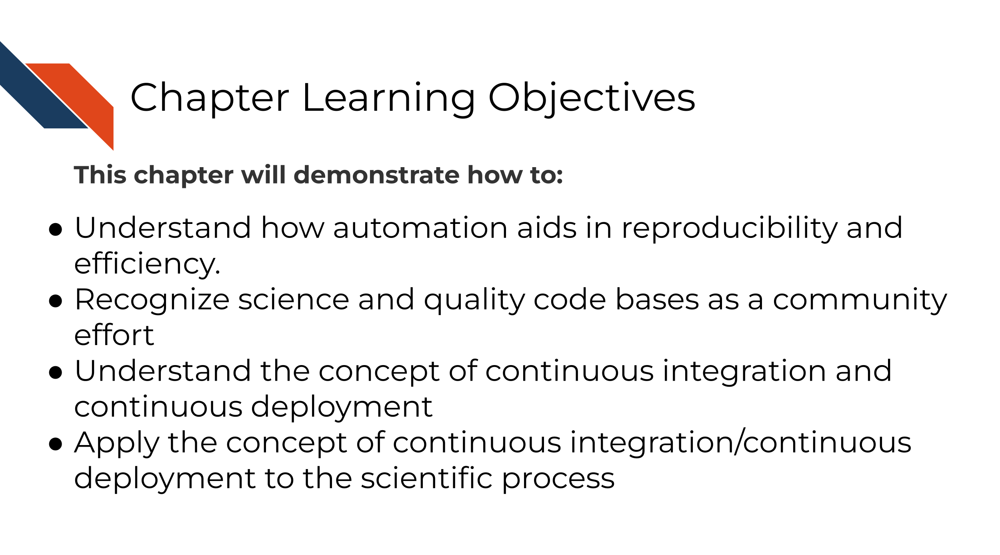

# Why Automation

## Automation as an aid for reproducibility 

All of science is built on results being reliable and continually working toward identifying more true/less wrong explanations about the world.

The process of science is first repeatability -- can the same researcher with the same data get the same results? Undoubtedly in the early stages of an analysis, sometimes the results and output can be in flux. But as the analysis gets further polished and decisions are made, it should be that the same results can be obtained no matter how many times an analysis is run or re-run by the same researcher.

This brings us to the critical but previously historically overlooked part of the pyramid known as reproducibility. Reproducibility is what happens when another researcher can take the same data as the research #1 and get the same results. This is more difficult than it sounds at face value because data analysis requires so many decisions and variables. The order and ease of which something is re-run and the computing environment used to run the analysis are two such factors.

Keep in mind that consistent results (like those seen with reproducible work) are not automatically true but inconsistent results (like those seen with irreproducible work) cannot be true. In other words, **correctness is not the same as reproducibility but reproducibility is a necessary aspect of correctness.**

Reproducibility is the overlooked but critical step that allows replicability to happen. Replicability is when new data is collected that extends the findings of the first study. With this new data, hopefully the same type of analysis can be done that helps the field learn even more about the concepts that were learned in the first study.

### Why reproducibility is so important.

Reproducibility is not only important because all of science is built upon it but it also saves everyone time!

We can often underestimate the extent to which our work, code, and data are being used and reused by others in the scientific community. The extent to which our work is reproducible then, not only affect us and our immediate collaborates but could aid or hinder other researcher's work in an exponential scale.

In other words, if 10 researchers reuse your work and all 10 of them spent 100 hours trying to get it to work **without** success, that's a lot of time to waste (10,000 hours)! But conversely, if your work was made with reproducibility aiding tools and skillsets (like automation that we are discussing in this course) then you could save other researchers loads of time! Let's say instead 9 out of 10 of the researchers who try to reproduce  your work (as opposed to running their own analysis from scratch) are able to do so in that time allotment, that saves them an insane amount of time and stress!

### Automation as a reproducibility tool

Automation is just one of many tools and skillsets that can aid the reproducibility of your work!

Returning to those 10 researchers, if instead of having those 10 people manually try to reproduce our work every time we change it, what if we had robots do that work instead? That would not only help us re-run our results more quickly (because researchers are often busy) but also robots are much better at repetitive work. In other words, your human collaborator is great at many things but even your most reliable collaborator will not be as punctual as a robot who is programmed to do the job.

## Continuous integration / Continuous deployment

Before we discuss the concept of Continuous integration / Continuous deployment (often abbreviated CI/CD), let's use an analogy.

Obviously we are getting at here, that generally its a good idea to check work along the way instead of waiting until something is completely finished to test it.

Software is no exception to this idea. Often if we send a collaborator an enormous amount of code to review; they are likely to feel overwhelmed and may not be able to give useful feedback.

But if you send a manageable, small chunk of code to review, they are likely to give more feedback.

Continuous Integration / Continuous Deployment then is a manner of working that means we will have changes checked as they are being integrated and before the changes are deployed. This allows for continuous monitoring of the project and hopefully early catching of bugs!

Bugs/mistakes are an unavoidable part of software development because software developers and researchers are generally humans and humans make mistakes!

Let's assume over the course of developing a project, bugs are introduced at a certain rate.

Without using CI/CD you may find yourself trying to fix many bugs at once! This will make the bugs harder to isolate and harder to fix and pinpoint. The amount of time it will take to fix 3 bugs at once may be exponentially higher than if you caught these bugs one at a time. Additionally, the longer amount of time that goes on before you catch a bug, it may be more likely it will get accidentally incorporated into your published results -- this will be a lot more work for you and others to rectify.

However with CI/CD you will likely catch these bugs earlier and have an easier time fixing them before they truly run amock! A good continuous integration / continuous deployment pipeline will help you identify these bugs early and save time and stress!

This is not only true for classic "my script won't run" bugs but also "silent" bugs -- bugs where the analysis still ran to completion but perhaps the results were slightly different.

### Continuous Integration / Continuous Deployment

A workflow that uses CI/CD principles may look like this:

The idea is we use version control and build aspects of our software. Before what we've built is incorporated into the published version, we will stage it and test it. By staging we mean that perhaps we keep it stored on a different branch and have ways that we can play around with the [beta version](https://en.wiktionary.org/wiki/beta_version) of the analysis or product before our most recent adds are incorporated.

The above diagram is in reference to more traditional software products but CI/CD can also be thought of in the context of an scientific data analysis:

In the case of a scientific analysis, we may modify or add to the analysis, but we'll want to test that these changes work -- aka we may want to re-run the analysis before we merge it into the `main` branch or public facing version.

In this instance we may think of the final product as being a published manuscript as opposed to deployed website or app. But the same principles here apply. We'll want to re-run the analysis and build tests that check if the results make sense.

### A real world example

Let's bring this into the terms of a very common story for science. Let's say you are a researcher who submitted a manuscript and a reviewer comes back and asks you to re run the analysis with a minor tweak; perhaps a parameter change.

If you developed your analysis without using reproducibility aiding practices and without automation, it is very likely that this seemingly simple task could take a lot of your time and brain power. Because while you don't think anything on your computer changed since you ran this analysis 6 months ago, your computing environment and the software it uses has been changing the entire time!

This kind of simple "this should be easy" situation can easily devolve into a huge rabbit hole -- when you thought this analysis was basically wrapped up.

But, if you had been using the principles of CI/CD and reproducibility you may have a better chance that your analysis should still run reliably. And if it doesn't re-run reliably you will have more runs and set up that you'll be able to pull from to pinpoint where the bug is in your analysis re-run that is keeping it from running.

By having automation keep tabs on your development, you will be less likely to be blind sided by bugs in a situation where you need to re-run your analysis (or adapt it for a new analysis!)

### Other CI/CD services

In this course we are focusing on using GitHub Actions for CI/CD. However, at this point we should mention that GitHub Actions is just one of many options for this. [Circle CI](https://circleci.com/), [Appveyor](https://www.appveyor.com/), and [Travis CI](https://www.travis-ci.com/) are all also perfectly fine options to use. But if you are using GitHub already, GitHub Actions may be the easiest to start out with. However, if at a later point in your automation development journey you find that GitHub Actions may not have a feature you need, we encourage you to explore these other options and use what works best for you. These other CI/CD options definitely have some commonalities with GitHub actions so learning GitHub Actions will still give you a good start in understanding how these services work.
